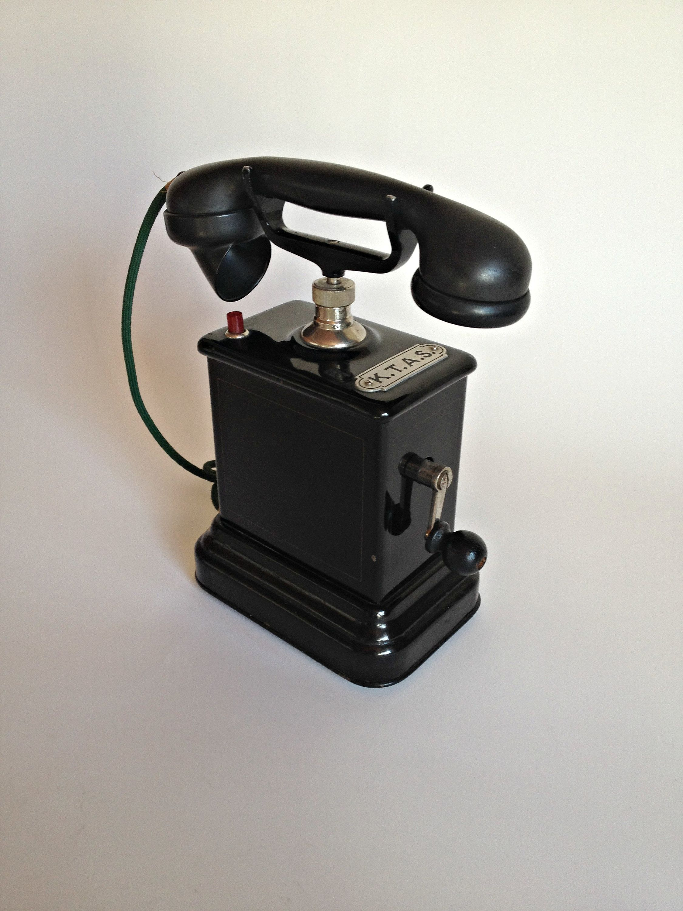

# K.T.A.S. M-35 (or MA-35)

This is the phone I plan to modify and make it a new stand-alone Dial-a-Joke.

The telephone was manufactured from 1935 to around 1950 for use under the manual (magneto) telephone exchanges in the outskirts of Copenhagen and in the province ("landcentralerne").
The telephone has been used by KTAS (Kjøbenhavns Telefon Aktieselskab) and Fyns Kommunale Telefonselskab. Produced by Kristian Kirks Telefonfabriker AS and Telefon Fabrik Automatic AS.
The telephone was in use until 19 December 1972, when the last M-exchange in the KTAS area, Central Egebjærg, was closed down.

## Techincal Details

### Links

Restoration and "modernization":

* https://www.ietfng.org/nwf/ee/crank-phone/index.html
* https://hackaday.com/2020/01/14/a-vintage-phone-in-2020/
* https://electronics.stackexchange.com/questions/98612/control-the-hardware-of-an-old-phone-using-a-raspberry-pi
* https://retro-mobile.blogspot.com/
* https://www.sparkfun.com/tutorials/51
  * https://www.sparkfun.com/tutorials/50

## Websites

* https://www.enigma.dk/artikel/samlerens-hjrne-collectors-corner/
* https://cubus-adsl.dk/elteknik/tele/hustelefonanlaeg.php
* https://telefon.qvotrup.dk/kirk-tfa-ma35-m35/